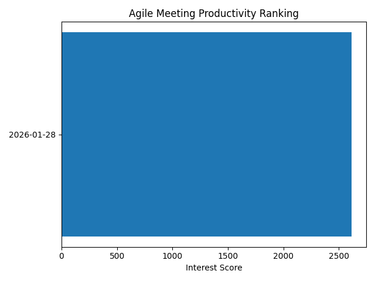
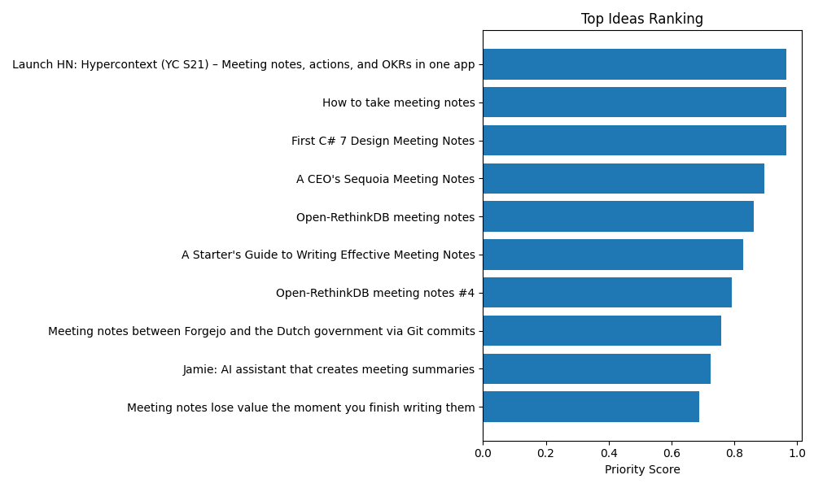

# engineering-playground
시장 분석 자동화, 클라우드 인프라, 시스템 실험을 위한 엔지니어링 플레이그라운드

## Demo: Agile Meeting Idea Ranking (Latest)

### 1) Meeting Productivity Ranking
- Report: `reports/latest_meeting_rank.md`



### 2) Top Ideas Inside Meeting
- Report: `reports/latest_idea_rank.md`



> The files above are automatically updated by the daily GitHub Actions pipeline.  
> `latest_*` files always point to the most recent successful pipeline run.

## Automation (GitHub Actions)

This pipeline runs automatically every day at **09:00 KST (00:00 UTC)**  
and can also be triggered manually via GitHub Actions.


- ⚙️ Execution: `python -m app.main`
- 📦 Outputs:
  - `reports/`
  - `snapshots/`
  - `data/reports/`

Workflow file: `.github/workflows/daily.yml`

---

## Run Locally

> Run the commands from the repository root (where `requirements.txt` exists).

```bash
pip install -r requirements.txt
python -m app.main